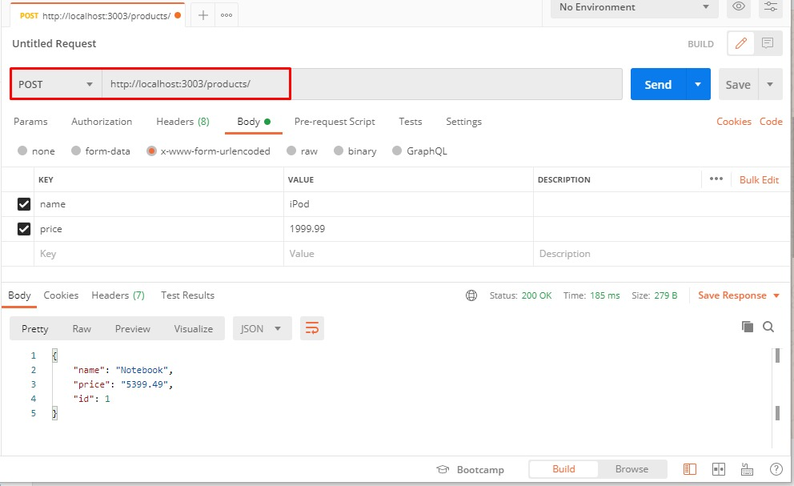
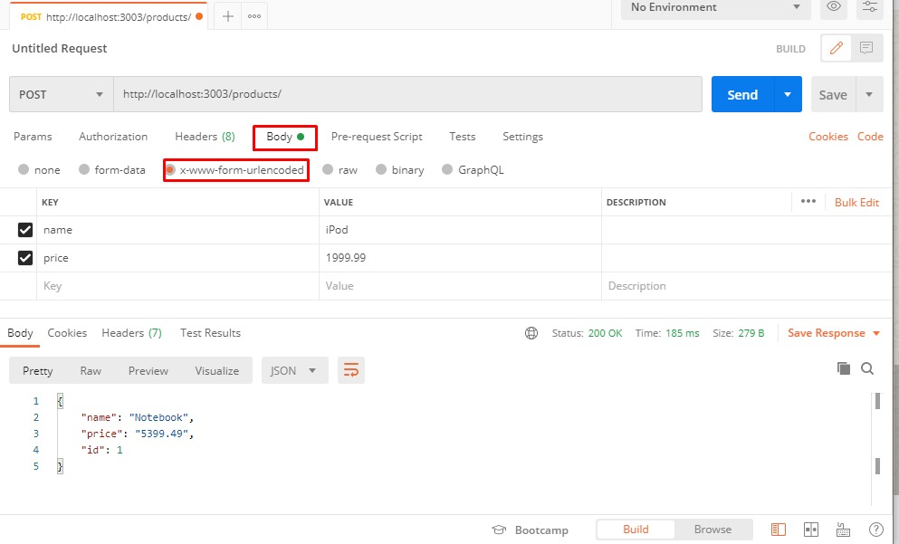
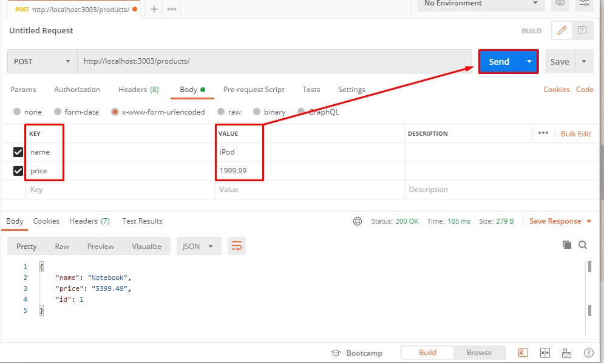
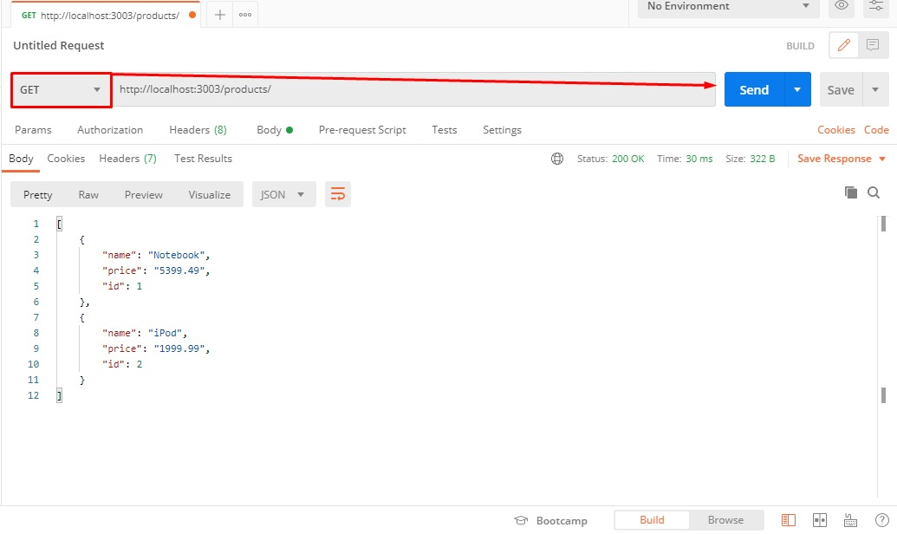
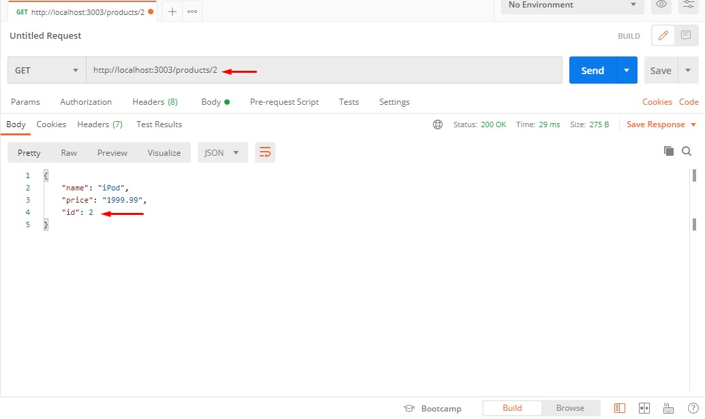
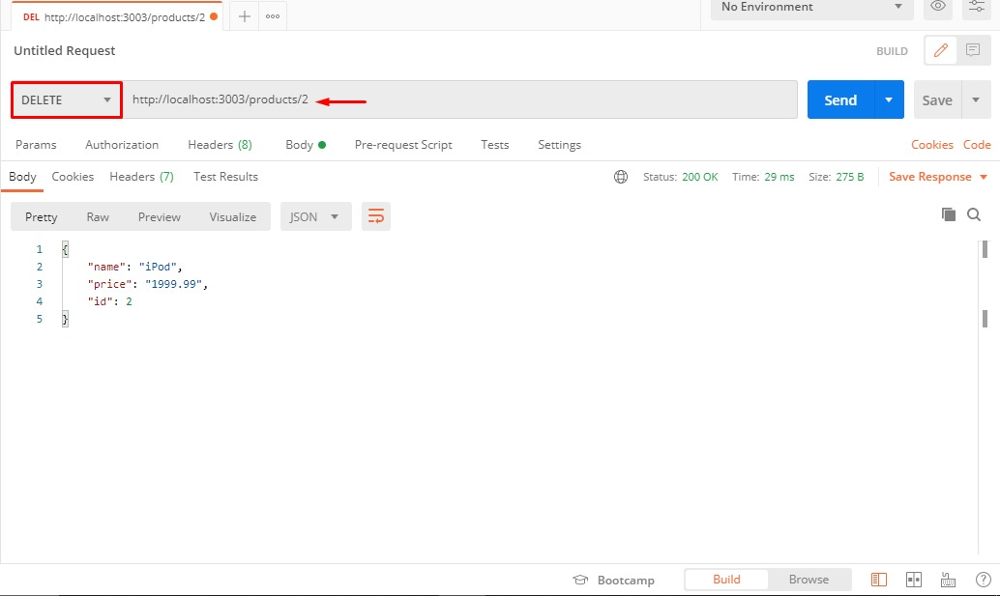
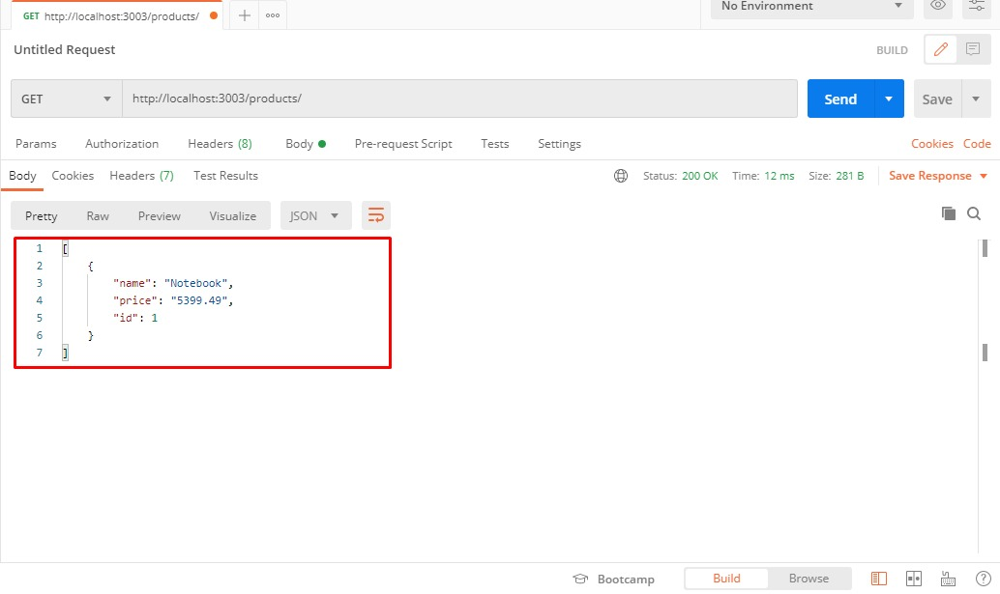

<p align="center">
</p>

## :clipboard: Index

- [About](#-About)
- [Utilized tecnology](#-Utilized-tecnology)
- [How to executed](#-How-to-executed)
- [Preview](#-Preview)

---

## :computer: Preview

<p align="center">
    
</p>

---

## :book: About

This project was developed together with the group **[@Cod3r](https://github.com/cod3rcursos)** during the course **[Web Moderno Completo com JavaScript 2020 + Projetos](https://www.udemy.com/course/curso-web/)**

Product registration using the "Postman" tool.

---

## :rocket: Utilized tecnology

This project focuses on the following technologies

- JavaScript
- Node.js
- Express

---

## How to executed

```bash
# Clone the repository
git clone https://github.com/SkinHx/api-with-express.git

# Enter directory
cd api-with-express

# Download dependencies
npm i

# Run the server
npm start
```
Ready? open Postman and go to `http://localhost:3003/products/`

#### POST method

<p align="center">
    
</p>

With the server still running, the process of adding products to our database is started.
With the 'POST' method, paste the URL for the project.

<p align="center">
    
</p>

Make sure you are in the 'Body' tab and the 'x-www-form-urlencoded' option is checked.

<p align="center">
    
</p>

So we can add our product.
The 'KEY' column will be the 'name' and 'price' attribute of our product.
In the column 'VALUE', the referring description.

We can press to send.

#### GET method

<p align="center">
    
</p>

To view all registered products, use the 'GET' method.

<p align="center">
    
</p>

To filter a product, add a '/' and the corresponding ID.

#### DELETE method

<p align="center">
    
</p>

To delete a specific item, add a '/' and the corresponding ID again with the 'DELETE' method.

<p align="center">
    
</p>

Return to the 'GET' method and see if our product no longer exists in the database.

---

I hope you enjoy.:purple_heart:

Developed by Eduardo Froelich.:metal: